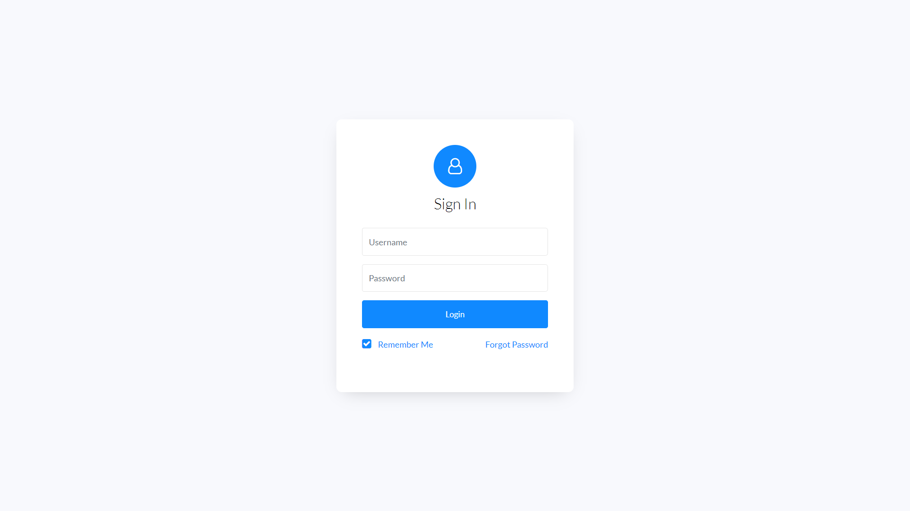

# Bulma Login Template

## Contributing

1. Fork it!
2. Create your feature branch: `git checkout -b my-new-feature`
3. Commit your changes: `git commit -am 'Add some feature'`
4. Push to the branch: `git push origin my-new-feature`
5. Submit a pull request!

## Licence

Code released under [the MIT license](https://github.com/aldi/bulma-login-template/blob/master/LICENSE.md).
